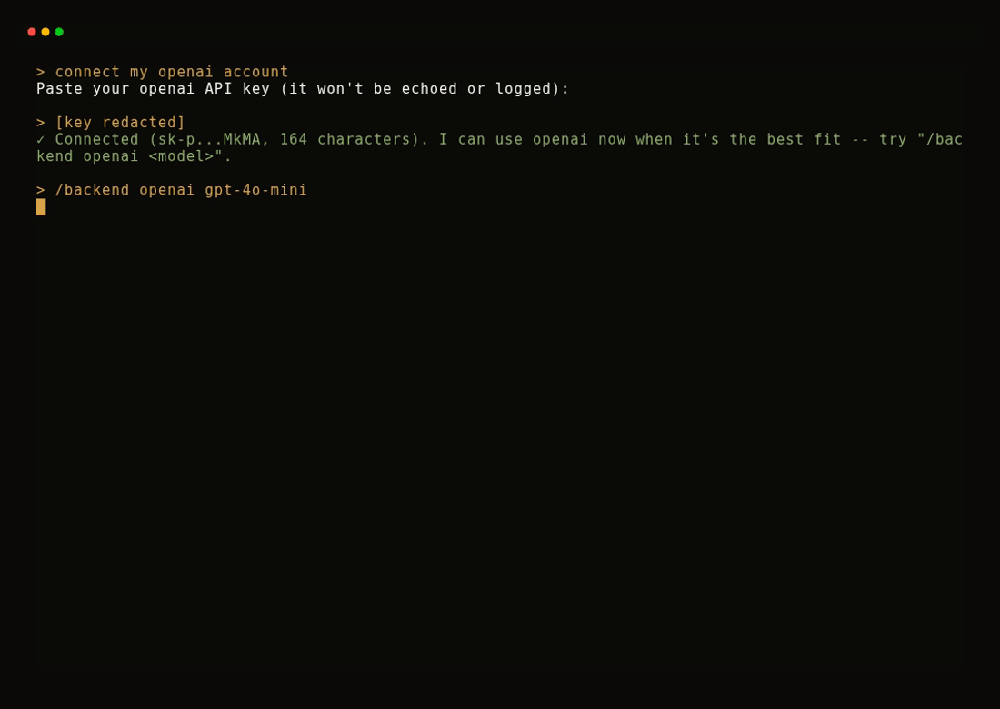

<div align="center">


[](https://github.com/JGalego/HyperionOS/actions/workflows/ci.yml) [](https://github.com/JGalego/HyperionOS/releases) [](LICENSE) [](docs/998-roadmap.md) [](docs/998-roadmap.md)

</div>

Hyperion is an intent-native operating system: humans express goals, and the system determines how those goals become reality.

It's resourceful, self-sustaining, and social — reaching for the right capability / tool, recovering from failure on its own, and treating other Hyperions as peers, not silos.

Want the thinking behind it? Read [`CLAUDE.md`](CLAUDE.md).

Want to know exactly what's built and what's next? See [the Roadmap](docs/998-roadmap.md).

See [`CHANGELOG.md`](CHANGELOG.md) for what's new in each release.

## 📑 Contents

- [✨ Features](#-features)
- [🧭 Philosophy](#-philosophy)
- [🧱 Architecture](#-architecture)
- [🚀 Getting started](#-getting-started)
- [🔨 Build it yourself](#-build-it-yourself)
- [💬 Try it locally](#-try-it-locally)
- [📄 License](#-license)

## ✨ Features

- **Speak your goal**: natural language replaces apps, files, and windows
- **Automatic task breakdown**: goals decompose into sub-tasks, assigned to specialized agents
- **Persistent memory**: a knowledge graph you can query with `/recall`, `/why`, `/related`
- **Local-first inference**: real on-device models via Candle, Ollama, vLLM, LiteLLM
- **Cloud when it helps**: optional OpenAI, Anthropic, Gemini, or Groq backends
- **Swap models live**: switch backends mid-session, no restart
- **Sandboxed capabilities**: plugins run isolated, behind explicit, revocable grants
- **Talks to other agents**: real MCP and A2A interoperability
- **Self-healing**: adaptive backoff, auto-resume, and cross-session learning from failures
- **Verifiable releases**: every image signed with Ed25519 and independently checkable
- **Accessible by default**: generated UI with accessibility built in, not bolted on
- **Fully explainable**: every action traceable, reversible, and undoable

<details>
<summary>Here's the <strong>full</strong> list of features per crate.</summary><br>

- **Capability tokens** (`hyperion-capability`) — unforgeable, scoped, revocable, attenuable tokens; the security primitive every other crate builds on.
- **Device identity & signing** (`hyperion-crypto`) — a persisted Ed25519 keystore signs and verifies content workspace-wide.
- **Encrypted secrets & sealed streams** (`hyperion-crypto`) — ChaCha20-Poly1305 secret storage and a reusable per-record encryption-at-rest primitive.
- **Cross-device key exchange** (`hyperion-crypto`) — real X25519 Diffie-Hellman key agreement for encrypted, authenticated sync.
- **WAL-backed storage engine** (`hyperion-storage`) — a write-ahead log is the sole atomicity boundary, with optimistic concurrency and crash-consistent replay recovery.
- **Compaction & per-object purge** (`hyperion-storage`) — collapses version history to current heads, or removes one object's full history for crypto-shred-grade erasure.
- **Opt-in encryption at rest** (`hyperion-storage`) — each WAL record can be sealed under a fresh, device-derived key.
- **Real Linux resource enforcement** (`hyperion-cgroups`) — translates scheduler decisions into real cgroups v2 CPU/memory/PID limits and `SCHED_DEADLINE` scheduling.
- **Kernel-enforced process sandboxing** (`hyperion-trust-boundary`) — real user namespaces, Landlock, and seccomp-bpf enforce a capability grant on an actually-spawned process.
- **Supervised PID 1 boot** (`hyperion-init`) — a real Linux init that mounts filesystems and launches every subsystem under a capability-scoped supervision tree.
- **Process supervision** (`hyperion-supervisor`) — Erlang/OTP-style fork, crash-detect, and respawn under a freshly minted grant, with give-up/alerting after repeated fast failures.
- **Capability-gated IPC** (`hyperion-ipc`) — call/response and notify messaging over an in-process bus or real Unix domain sockets between processes.
- **Noise-protocol encrypted sessions** (`hyperion-ipc`) — real `Noise_NN` handshakes seal every IPC claim instead of plaintext.
- **Admission control & fair dispatch** (`hyperion-scheduler`) — Weighted-EDF + Dominant-Resource-Fair scheduling across CPU/RAM/GPU/storage/network/inference-tokens/battery.
- **Model-tier degradation & federated offload** (`hyperion-scheduler`) — retries at a cheaper model tier, or offloads to a peer device, when local resources don't fit.
- **Live load-signal feedback** (`hyperion-scheduler`) — real EWMA-derived CPU/battery/thermal signals from telemetry feed scheduling decisions.
- **Capability-scoped event bus** (`hyperion-events`) — publish/subscribe with per-subscription delivery-class/backpressure policy and durable replay recovery.
- **Tiered device pairing & presence** (`hyperion-device`) — view/sense/actuate-tiered pairing with explicit confirmation for actuation, plus a real connectivity state machine.
- **Signed manifests & KG mirroring** (`hyperion-device`) — Ed25519-signed device manifests, mirrored live as Knowledge Graph nodes.
- **Web research pipeline** (`hyperion-netstack`) — real HTTP/TLS/DNS fetch, prompt-injection quarantine scanning, entity extraction, and Knowledge Graph merge under domain-egress grants.
- **Structured signal extraction** (`hyperion-netstack`) — parses real schema.org/JSON-LD/OpenGraph microformats and respects `robots.txt`.
- **Cross-device capability offload** (`hyperion-federation`) — scores and places capability calls on remote devices, and migrates in-flight agent sessions between instances.
- **Encrypted device sync** (`hyperion-federation`) — sealed, signed TCP transport carries ledger publications and anti-entropy Knowledge Graph replication.
- **Privacy-tier consent routing** (`hyperion-privacy`) — deny-by-default, never-assume-consent gate backed by a signed, revocable consent ledger.
- **Consent-gated erasure** (`hyperion-privacy`) — soft-delete with an undoable grace period, or crypto-shred with full WAL purge.
- **Risk-assessment engine** (`hyperion-security`) — a composite risk score (blast radius, reversibility, sensitivity, provenance) triggers backup-then-confirm gating, with hard floors for tainted or irreversible actions.
- **Provenance trust scoring** (`hyperion-security`) — re-ranks Knowledge Graph context by real origin/corroboration/age trust, defending against poisoned data.
- **Recovery points & conflict-aware undo** (`hyperion-recovery`) — bounded pre-action snapshots with undo/redo that detects real conflicts instead of blind restoration.
- **Crash recovery** (`hyperion-recovery`) — automatically rolls back every in-flight action and respawns a fresh agent on restart.
- **Tamper-evident audit ledger** (`hyperion-observability`) — a BLAKE3 hash-chained, Ed25519-anchored log detects corruption or gaps, with background self-verification.
- **Telemetry & cross-device tracing** (`hyperion-observability`) — metrics/logs/spans with retention-based compaction and real distributed-trace reconstruction across devices.
- **Explanation records** (`hyperion-explainability`) — every autonomous action opens a queryable explain-then-commit record with reasoning, confidence, and evidence.
- **Self-consistency confidence** (`hyperion-explainability`) — real repeated-sampling confidence scoring with rolling calibration tracking per agent/capability.
- **Staged, health-gated rollout** (`hyperion-update`) — signature-verified updates advance through 1%/10%/50%/100% stages, auto-rolling back on a health breach.
- **A/B image rollback** (`hyperion-update`) — slot-pointer-flip rollback with anti-rollback protection against re-flashing downgraded images.
- **Release candidate gate** (`hyperion-release-gate`) — aggregates test/benchmark results (with statistical regression checks) into one pass/block/quarantine decision.
- **Capability degradation ladder** (`hyperion-scalability`) — cheaper tier → alternate implementation → consented cloud upgrade → disable, checked against real scheduler headroom.
- **Multi-tenant KG partitioning** (`hyperion-scalability`) — tenant-scoped nodes/edges block cross-tenant writes unless explicitly granted.
- **Threat regression catalog** (`hyperion-threat-model`) — eight attacker-goal/mitigation pairs, each backed by a passing cross-crate regression test.
- **Plugin manifest gate** (`hyperion-plugin-framework`) — rejects over-requested permissions before consent, mints exactly the requested tokens, cascade-revokes on uninstall.
- **Signed plugin install/update** (`hyperion-plugin-framework`) — verifies real Ed25519 publisher signatures and shows only newly-added grants on update.
- **Third-party capability test harness** (`hyperion-sdk`) — golden-case and static permission checks gate a capability before it's signed and installed.
- **Generated-code review pipeline** (`hyperion-sdk`) — freshly generated Rust is rejected on `unsafe`, then actually compiled and clippy-linted before install.
- **Unified capability gateway** (`hyperion-api-gateway`) — one authenticated entry point routes Intent/Knowledge-Graph/Memory/Context calls to their real backends.
- **Ensemble verification dispatch** (`hyperion-api-gateway`) — re-runs a second, architecturally distinct implementation to cross-check high-stakes results.
- **Sandboxed legacy app compatibility** (`hyperion-compat`) — runs Windows/Linux/Android-style sessions in a real Linux namespace/Landlock/seccomp sandbox with default-deny filesystem access.
- **Real headless web rendering** (`hyperion-compat`) — fetches and renders pages via a real headless Chromium binary, returning the actual post-script DOM.
- **Unified node/edge graph** (`hyperion-knowledge-graph`) — typed, weighted, bidirectionally-traversable graph with vector similarity search, materialized over a durable WAL.
- **Owner-scoped ACL & tombstoning** (`hyperion-knowledge-graph`) — per-object access control, real deletion, and full WAL-history purge for crypto-shred-grade erasure.
- **Explainable ranking & decay** (`hyperion-knowledge-graph`) — shows why a result ranked where it did, and decays/prunes low-confidence inferred edges over time.
- **Query-as-navigation virtual filesystem** (`hyperion-semantic-fs`) — synthesizes stable virtual folder paths from structured or POSIX-style queries over the live graph.
- **Real mounted FUSE filesystem** (`hyperion-semantic-fs`) — a genuine, kernel-mounted POSIX view of the Knowledge Graph on Linux.
- **Universal search** (`hyperion-semantic-fs`) — resolves natural-language mentions ("everything about my vacation") into folder queries.
- **Four-tier memory** (`hyperion-memory`) — Episodic/Semantic/Procedural/Long-Term tiers with decay-weighted consolidation and frequency-gated promotion.
- **Model-assisted salience & distillation** (`hyperion-memory`) — real model-generated salience scoring and working-memory-to-episodic summarization.
- **HTN utterance decomposition** (`hyperion-intent`) — parses utterances into dependency-linked Intent Graphs via deterministic template matching, stored as real graph nodes.
- **Model-generated fallback planning** (`hyperion-intent`) — an utterance matching no template gets a real, model-generated step plan instead of an inert root.
- **"Think mode" checkpoint** (`hyperion-intent`) — pauses decomposition for explicit human confirmation before committing to what a goal means.
- **Context bundle assembly** (`hyperion-context`) — relevance-ranked, budget-bounded context from a live Knowledge Graph, weighted by provenance trust.
- **Signed context propagation** (`hyperion-context`) — cryptographically signed, trust-level-redacted context envelopes across trust boundaries.
- **Adaptive expertise estimation** (`hyperion-context`) — tracks real vocabulary/capability/error-recovery signals into a blended user expertise estimate.
- **Weighted model/implementation selection** (`hyperion-model-router`) — candidate-gathering → privacy-gate → feasibility-gate → weighted-scoring pipeline with fallback chains and a circuit breaker.
- **Canary rollout routing** (`hyperion-model-router`) — deterministically samples a declared traffic percentage into health-gated canary candidates.
- **Local model inference** (`hyperion-ai-runtime`) — a real Candle-loaded model runs on CPU with hardware-adaptive tier step-down and cancellable inference.
- **Pluggable cloud/local backends** (`hyperion-ai-runtime`) — real Ollama/vLLM, OpenAI, Anthropic, and Gemini backends, each consent-gated for cloud use.
- **Signed model catalog** (`hyperion-ai-runtime`) — Ed25519 + BLAKE3 verified catalog checks model file integrity before load.
- **Capability-gated agent lifecycle** (`hyperion-agent-runtime`) — agents run as capability-scoped roles with a consent-gated broker and a runaway-failure circuit breaker.
- **Real AI/web/cloud dispatch** (`hyperion-agent-runtime`) — `assistant.respond`, `web.research`, and cloud provider calls dispatch to real backends under per-call consent.
- **Multi-agent task allocation** (`hyperion-coordination`) — assigns HTN-decomposed tasks to trust-tier-eligible agents, with automatic retry-then-escalation on failure.
- **"Protect the Human" judgment tagging** (`hyperion-coordination`) — flags tasks needing taste/empathy judgment versus purely mechanical ones.
- **Recovery & explainability integration** (`hyperion-coordination`) — every dispatch opens an Explanation Record and a scoped recovery point for undo.
- **Text-console assistant pipeline** (`hyperion-console`) — a typed utterance drives Intent parsing, coordination/dispatch, and workspace-rendered text output end to end.
- **Real visual rendering & OS accessibility** (`hyperion-shell`) — the same compiled Workspace as the console, rendered as real pixels with genuine NVDA/VoiceOver/Orca screen-reader exposure.
- **Dual visual/accessibility compilation** (`hyperion-workspace`) — one pass compiles both a visual graph and a semantic accessibility tree, so they can never drift apart.
- **Multiple modality projections** (`hyperion-workspace`) — screen-reader linearization, voice-control grammar, and switch-scan grouping, all derived from one UI contract.
- **Live incremental re-rendering** (`hyperion-workspace`) — diffs and patches just the affected panel instead of recompiling the whole workspace.
- **Shared turn pipeline** (`hyperion-turn`) — one utterance→outcome→workspace pipeline shared between the console and visual shell, not duplicated in each.

</details>

## 🧭 Philosophy

> Your goals are the operating system.

Every prior operating system asked you to manage proxies for what you wanted: a process, a file, a window, an application. 

Hyperion manages what you actually have.

| Old OSes | Hyperion |
|---|---|
| Processes | Goals |
| Threads | Intentions |
| Files | Knowledge |
| Windows | Context |
| Applications | Memory, reasoning, capabilities |

## 🧱 Architecture

> You speak. Everything else listens.

Hyperion is built in layers, each one building on the one below it.

Closer to the hardware, it's fast and safe.

Closer to you, it understands what you mean.

<details>
<summary><code>L0</code> <strong>Kernel</strong> — where it begins</summary><br>

The hardware layer everything else stands on. It's open source, so its safety claims are checkable. Capability-secured from the ground up: nothing crosses a trust boundary without an explicit, revocable grant.
</details>

<details>
<summary><code>L1</code> <strong>System runtime</strong> — how it stays fast and safe</summary><br>

Schedules work across CPU, GPU, memory, and battery, keeping every process in its own boundary. A unified scheduler balances compute, inference tokens, and context windows, the way earlier operating systems balanced CPU and RAM.
</details>

<details>
<summary><code>L2</code> <strong>Platform services</strong> — what it's built from</summary><br>

Reusable capabilities, storage, updates, and networking. Capabilities are Hyperion's replacement for the application: a declared contract, a trust level, and one or more interchangeable implementations.
</details>

<details>
<summary><code>L3</code> <strong>Knowledge</strong> — what it knows and remembers</summary><br>

Your information, connected by meaning. Every document, photo, message, or project is a Semantic Object with typed relationships to everything else: a knowledge graph standing in for folders and filenames.
</details>

<details>
<summary><code>L4</code> <strong>Cognition</strong> — where it thinks</summary><br>

Understands what you're asking for, recalls what's relevant, and picks the right model for the job. The Intent Engine turns language into a graph of sub-goals. The Context Engine attaches what already exists (a calendar event, a past conversation). The Model Router picks local or cloud reasoning per task.
</details>

<details>
<summary><code>L5</code> <strong>Coordination</strong> — how the work gets organized</summary><br>

When a goal needs more than one specialist, this layer decides who does what, and keeps a record of why. Multi-agent orchestration assigns sub-goals to specialized agents and resolves conflicts between them. Every decision is logged for you to inspect.
</details>

<details>
<summary><code>L6</code> <strong>Experience</strong> — what you see and say</summary><br>

Conversation, generated screens, and voice: the only parts of Hyperion you directly touch. The Dynamic UI Runtime assembles a Workspace on demand for whatever you're doing, then tears it down when you're done. Accessibility is built into that runtime.
</details>

#### Example: `"I need to launch my startup."`

- <code>L6</code> The console captures it.
- <code>L4</code> The Intent Engine splits it into sub-goals — market research, a business model, branding, legal formation.
- <code>L5</code> Coordination assigns each sub-goal to a specialized agent.
- <code>L4</code> Each agent gets its answer by invoking a capability, routed to whichever model fits.
- <code>L3</code> Everything learned along the way is written into the knowledge graph, connected to everything else you know.
- <code>L2</code>/<code>L1</code>/<code>L0</code> Every one of those steps was checked against a capability grant first, and scheduled safely underneath.
- <code>L6</code> The results land back as one workspace — not four separate app windows.

## 🚀 Getting started

Every tagged release publishes ready-to-flash disk images for both reference platforms on the [Releases](https://github.com/JGalego/HyperionOS/releases) page:

| Platform | Download | Boots via |
|---|---|---|
| x86_64 | `hyperion-x86_64-<version>.img` | UEFI (GPT disk image, EFI System Partition + GRUB2) |
| aarch64 | `hyperion-aarch64-<version>-Image` + `hyperion-aarch64-<version>-rootfs.ext2` | direct kernel boot |

For most people **x86_64 is the one to grab** - it's a single, complete disk image.

### Put it on a USB drive

1. Download `hyperion-x86_64-<version>.img` from the [latest release](https://github.com/JGalego/HyperionOS/releases/latest).
2. Install [balenaEtcher](https://etcher.balena.io/) (Windows/macOS/Linux).
3. Open Etcher, select the downloaded `.img` file, select your USB drive, and flash. Etcher writes the raw image directly and verifies the write afterward - no need to unpack or convert anything.
4. Boot the target machine from the USB drive (usually a one-time boot-menu key like F12/F10/Esc at power-on) and select it.

Double-check the drive you select in Etcher - flashing overwrites everything on it.

### Check what you downloaded

Every image ships with proof that it's untampered and really came from this project: a `.release.json` manifest holding a BLAKE3 hash of the image and an Ed25519 signature over that hash, signed with Hyperion's release key. Check it against the real, published verifying key before you trust it:

```
b5c19b1e890fed3e164342f0285f6a1a1635d724f2284a2ebe00589a122ac90a
```

To verify (needs a Rust toolchain and this repo checked out):

```sh
cargo run --release -p hyperion-release-gate --bin verify-release -- \
  hyperion-x86_64-<version>.img hyperion-x86_64-<version>.img.release.json
```

This recomputes the hash directly from the image's own bytes (it never trusts the manifest's own recorded hash) and confirms the signature checks out against the manifest's recorded key - compare that key against the one published above.

## 🔨 Build it yourself

See [the Roadmap](docs/998-roadmap.md) and the scripts under [boot/scripts/](boot/scripts/) (`build-image.sh` for x86_64, `build-image-aarch64.sh` for aarch64) if you'd rather build an image from source than download one.

## 💬 Try it locally

For development, the fastest loop is a native build of `hyperion-console` on your own machine - no image, no boot:

```sh
cargo build -p hyperion-console --bin hyperion-console
HYPERION_CONSOLE_DATA_DIR=/tmp/hyperion-scratch ./target/debug/hyperion-console scenarios/backend-mock.txt
```

A real, live recording of [`scenarios/onboarding-new-user-launches-startup.txt`](scenarios/onboarding-new-user-launches-startup.txt) - bare `help`, conversational continuity, the decomposed "launch my startup" plan, then `/result`, `/recall`, `/why`, and `/related`:


```
> my name is Alex
status: done -- [mock model 1] echo: my name is Alex

> launch my startup
  market_research: Done
  business_model: Done
  branding: Done
  legal_formation: Done
status: market_research: Done -- [mock model 1] echo: Provide a concise research summary about market_research -- launch my startup. ... (see "/result market_research" for the full text)
status: business_model: Done -- [mock model 1] echo: Draft a concise, practical business_model -- launch my startup. (see "/result business_model" for the full text)
status: branding: Done -- [mock model 1] echo: Draft a concise, practical branding -- launch my startup. (see "/result branding" for the full text)
status: legal_formation: Done -- [mock model 1] echo: Draft a concise, practical legal_formation -- launch my startup. (see "/result legal_formation" for the full text)
```

See [Usage Scenarios](docs/999-usage-scenarios.md) for how scenarios work, the full set under [`scenarios/`](scenarios/), and how to point one at a real backend (Candle, a local engine, or a cloud provider).

### Inspecting the knowledge graph

`/graph` dumps everything the current session has recorded - real nodes and edges, not a summary. Run it before and after a scenario to see exactly what changed; the output is sorted by id, so an unchanged graph dumps identically every time and any real diff is a real change:

```
> my name is Alex
status: done -- [mock model 1] echo: my name is Alex

> /graph
1 node:
  [0] intent -- you asked: "my name is Alex" (30% confident) (created 1784044847, updated 1784044847)

0 edges:
```

`/graph dot` prints the same graph as Graphviz DOT instead, for when you actually want to draw it:

```sh
printf '%s\n' "launch my startup" "/graph dot" > /tmp/graph-demo.txt
./target/debug/hyperion-console /tmp/graph-demo.txt | sed -n '/digraph/,/^}/p' | dot -Tsvg -o graph.svg
```

A real, live recording of [`scenarios/knowledge-graph-growth-audit.txt`](scenarios/knowledge-graph-growth-audit.txt) - `/graph` empty, a real action that grows it, `/graph` again, then `/graph dot`:


### Talking to another Hyperion instance

`/mcp-server` and `/a2a-server` turn a running console into a real MCP or A2A server over HTTP; `/standby` keeps the process alive afterward so you can test it from another terminal:

```sh
printf '/mcp-server 8765\n/standby\n' > /tmp/mcp-demo.txt
HYPERION_CONSOLE_DATA_DIR=/tmp/hyperion-mcp-demo ./target/debug/hyperion-console /tmp/mcp-demo.txt
```

From a second terminal:

```sh
curl -s http://127.0.0.1:8765/ -d '{"jsonrpc":"2.0","id":1,"method":"tools/call","params":{"name":"hyperion.ask","arguments":{"prompt":"my name is Alex"}}}'
```

`/mcp-call <host> <port> <tool> <json args>` and `/a2a-call <host> <port> <message>` are the outbound half - a real Hyperion instance calling out to another one. See [Usage Scenarios](docs/999-usage-scenarios.md#12-social--two-real-hyperion-processes-talk-over-real-mcp-and-a2a) for a full, live-verified transcript, and [the Roadmap](docs/998-roadmap.md) for what's real today across Hyperion's resourceful/social/self-sustaining pillars versus what's still deliberately deferred.

To use a real cloud provider (OpenAI, Anthropic, Gemini, Groq) or a local engine that needs its own key, copy [`.env.example`](.env.example) to `.env`, fill in the real value, then:

```sh
set -a && source .env && set +a
cargo build -p hyperion-console --bin hyperion-console --features openai-compat
HYPERION_CONSOLE_DATA_DIR=/tmp/hyperion-scratch ./target/debug/hyperion-console scenarios/backend-cloud-groq.txt
```

A real, live recording of [`scenarios/cloud-provider-comparison.txt`](scenarios/cloud-provider-comparison.txt) - the same question asked of three real cloud providers (OpenAI, Anthropic, Groq) in one session:



`.env` is already gitignored, so a real key never gets committed. A scenario file only ever references a key by name (`$GROQ_API_KEY`), never as a literal - see [Usage Scenarios](docs/999-usage-scenarios.md)' "Running a scenario from a file" for how that expansion works.

## 📄 License

MIT - See [LICENSE](LICENSE)
